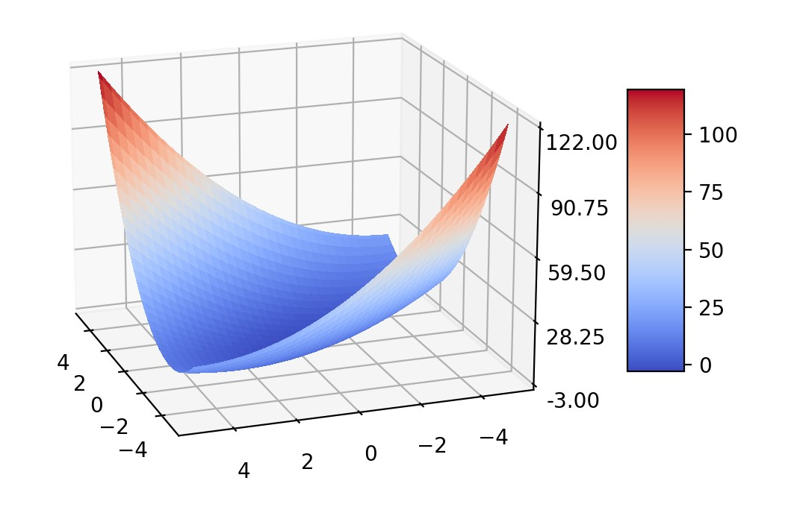
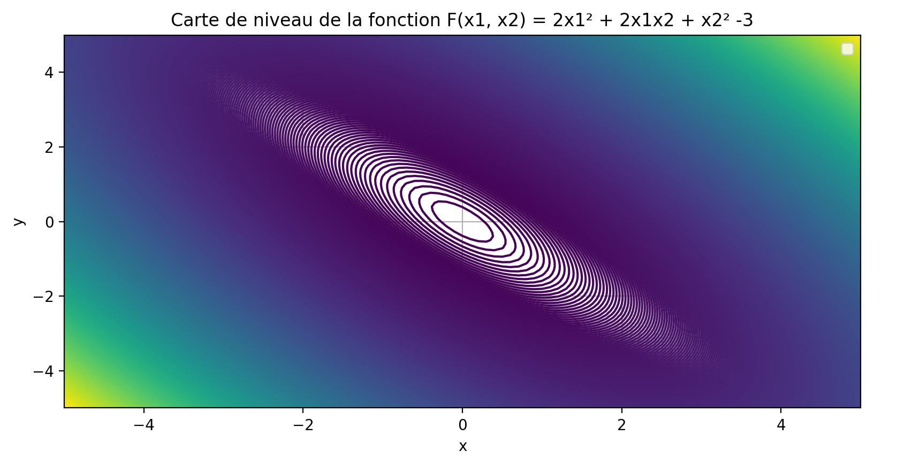
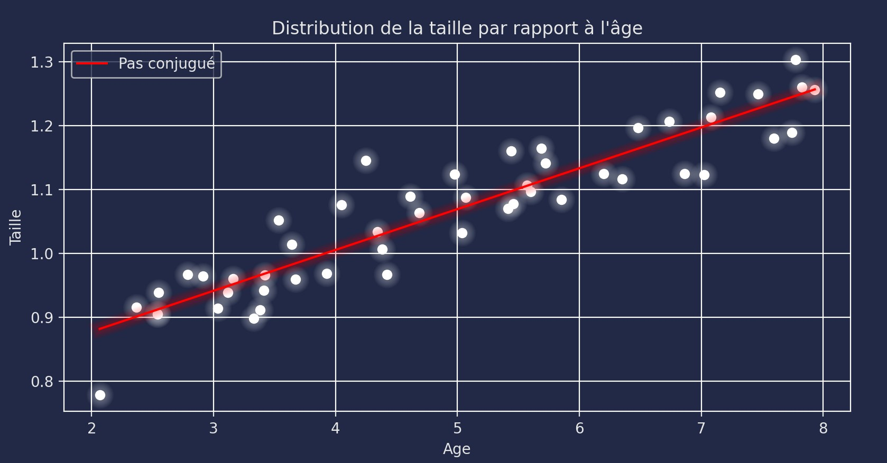

<!-- PROJECT LOGO -->
 

  

<h3 align="center">Quadratic Optimization Project (School project)</h3>

<!-- ABOUT THE PROJECT -->
## About The Project

This is a mathematics project, dealing with quadratics optimizations.

On this repository, you can find elements to build a 3D surface for generic quadratics (you can choose yourself). There is also codes to build a levels card chart and partial functions for a given quadratic.

### Built With

* [Python](https://www.python.org)

<!-- USAGE EXAMPLES -->
## Screenshots

(<a href="#top">back to top</a>)

